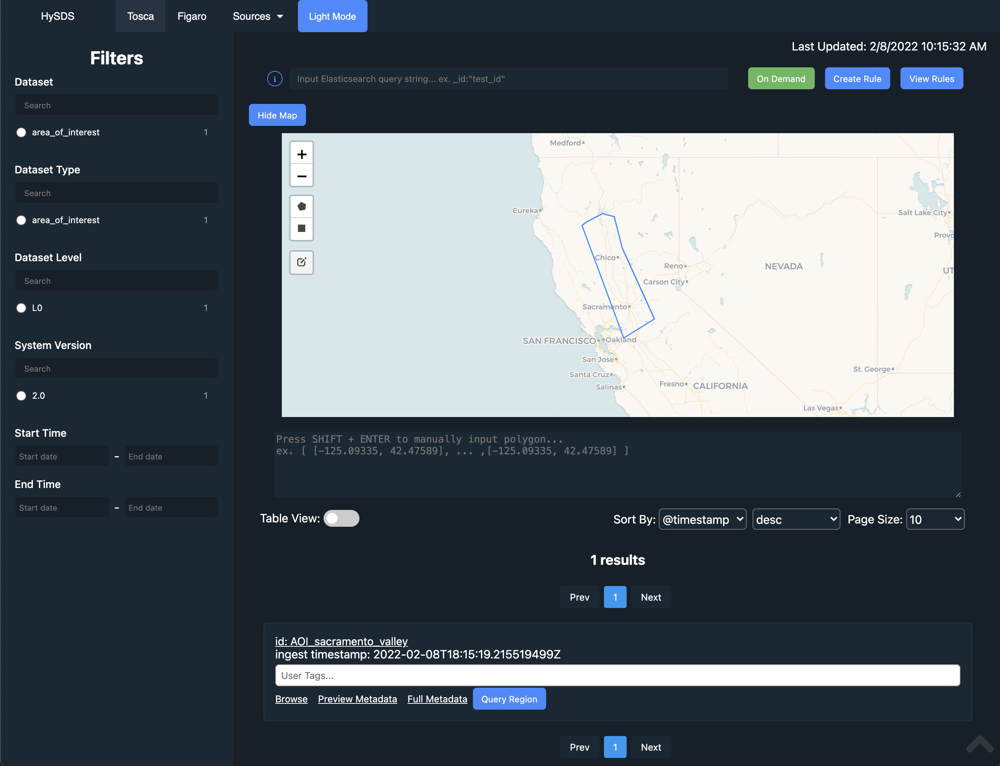
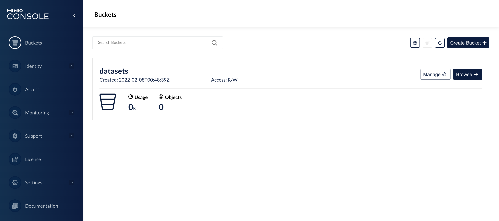
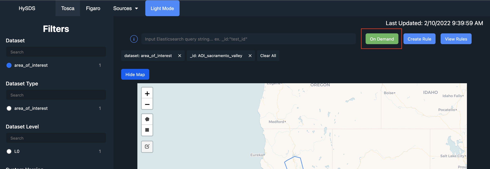
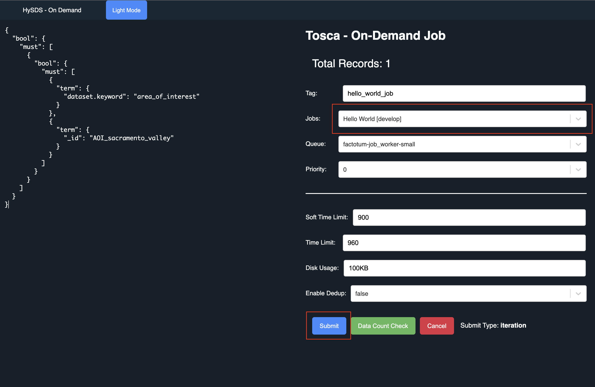

# Pre-requisites

- [Docker](https://www.docker.com/products/docker-desktop)
- [Kubernetes](https://kubernetes.io/)
  - Enable Kubernetes in [Docker for Desktop](https://docs.docker.com/desktop/kubernetes/#enable-kubernetes) or use [Minikube](https://minikube.sigs.k8s.io/docs/start/).
- [kubectl](https://kubernetes.io/docs/reference/kubectl/) - kubernetes command line tool.
- [Helm](https://helm.sh/docs/intro/install/)
  - `brew install helm`, if on Mac.
- [Terraform](https://learn.hashicorp.com/tutorials/terraform/install-cli)

> :warning: if you're a Linux user, you can create a directory called `/private`

```bash
$ sudo mkdir -p /private/tmp/data
$ sudo chown -R $UID:$(id -g) /private/tmp
```

# Docker Resource Settings

> :warning: **Make sure to set "Memory" to value >= 6.0GB**


# Building the Docker image(s)

## Building the Base `hysds` Docker Image

Use the `hysds/build_images.sh` script to build all necessary Docker images at once.

```bash
$ ./build_images.sh [--progress plain|--no-cache]
```

```bash
$ docker images
REPOSITORY          TAG                  IMAGE ID       CREATED         SIZE
hysds-ui            unity-v0.0.1         08d98f617351   3 hours ago     19.3MB
verdi               unity-v0.0.1         cd9eff273a89   3 hours ago     1.17GB
hysds-grq2          unity-v0.0.1         c89d99d41e3b   3 hours ago     1.08GB
hysds-mozart        unity-v0.0.1         515d0bf75e50   3 hours ago     1.04GB
hysds-core          unity-v0.0.1         e1ab6d70f58e   3 hours ago     934MB
```

## Building the OGC ADES/WPS-T Flask API Docker Image

Follow the directions described in the README of the [unity-sds/ades_wpst](https://github.com/unity-sds/ades_wpst) repository.

# Deploying the SPS Cluster Locally

The cluster can be deployed with two different methods which are described in the following subsections.

## Method 1: Deploy via Bash Script

Use the `hysds/deploy.sh` script to deploy all resources at once.

```bash
$ ./deploy.sh --help
# Usage:
#   Deploys the HySDS cluster in Kubernetes (Elasticsearch, Rest API, RabbitMQ, Redis, etc.)
#   ./deploy.sh [--docker] [mozart] [grq] [--all]
#   Options:
#     --all : deploy all HySDS resources (Mozart + GRQ + factotum)
#     mozart : deploy Mozart cluster
#     grq : deploy GRQ cluster
#     factotum : deploy factotum

$ ./deploy.sh --all
```

## Method 2: Deploy via Terraform

This method will use Terraform to deploy the Kubernetes cluster represented by the `~/.kube/config` file which is referenced in `terraform/main.tf`. Terraform will deploy the resources in the Kubernetes namespace named in `terrafrom/variables.tf` (defaults to `unity-sps`).

From within the Terraform module directory (terraform/), run the following commands to initialize, and apply the Terraform module:

```bash
$ terraform init
$ terraform apply
```

# HySDS Resources

- [Mozart's rest API](https://github.com/hysds/mozart): `http://localhost:8888`
- [GRQ's rest API](https://github.com/hysds/grq2): `http://localhost:8878/api/v0.1/doc/`
- Elasticsearch
  - Mozart: `http://localhost:9200`
  - GRQ: `http://localhost:9201`
- [HySDS UI](https://github.com/hysds/hysds_ui): `http://localhost:3000`
- [Minio](https://min.io/) Server (local s3) - `http://localhost:9000` and `http://localhost:9001`



```bash
$ kubectl get all
NAME                                       READY   STATUS      RESTARTS   AGE
pod/factotum-job-worker-58597f47f4-ct5cs   1/1     Running     0          2m14s
pod/grq-es-master-0                        1/1     Running     0          3m15s
pod/grq2-cbc7bdf6f-z5j6f                   1/1     Running     0          2m20s
pod/hysds-ui-6c5d969498-9mp55              1/1     Running     0          3m17s
pod/logstash-f6897dbb7-bq652               1/1     Running     0          3m18s
pod/mc                                     0/1     Completed   0          2m14s
pod/minio-66b9cc99c8-c2xvh                 1/1     Running     0          2m14s
pod/mozart-cd9ffc587-rgdjx                 1/1     Running     0          3m18s
pod/mozart-es-master-0                     1/1     Running     0          4m13s
pod/orchestrator-d989856b9-mcdzq           1/1     Running     0          2m14s
pod/rabbitmq-0                             1/1     Running     0          3m18s
pod/redis-6f486db698-b2plf                 1/1     Running     0          3m18s
pod/user-rules-548485c5bb-hbdcl            1/1     Running     0          2m14s

NAME                         TYPE           CLUSTER-IP       EXTERNAL-IP   PORT(S)                                         AGE
service/grq-es               LoadBalancer   10.100.216.57    localhost     9201:31651/TCP,9301:30670/TCP                   3m15s
service/grq-es-headless      ClusterIP      None             <none>        9201/TCP,9301/TCP                               3m15s
service/grq2                 LoadBalancer   10.98.57.177     localhost     8878:32353/TCP                                  2m20s
service/hysds-ui             LoadBalancer   10.101.127.235   localhost     3000:31000/TCP                                  3m17s
service/kubernetes           ClusterIP      10.96.0.1        <none>        443/TCP                                         26d
service/minio                LoadBalancer   10.100.0.194     localhost     9000:30818/TCP,9001:32193/TCP                   2m14s
service/mozart               LoadBalancer   10.106.71.131    localhost     8888:31618/TCP                                  3m18s
service/mozart-es            LoadBalancer   10.105.160.254   localhost     9200:32161/TCP,9300:31784/TCP                   4m13s
service/mozart-es-headless   ClusterIP      None             <none>        9200/TCP,9300/TCP                               4m13s
service/rabbitmq             NodePort       10.108.145.184   <none>        4369:30853/TCP,5672:31886/TCP,15672:31243/TCP   3m18s
service/rabbitmq-mgmt        LoadBalancer   10.102.101.114   localhost     15672:31752/TCP                                 3m18s
service/redis                NodePort       10.106.16.166    <none>        6379:32275/TCP                                  3m18s

NAME                                  READY   UP-TO-DATE   AVAILABLE   AGE
deployment.apps/factotum-job-worker   1/1     1            1           2m14s
deployment.apps/grq2                  1/1     1            1           2m20s
deployment.apps/hysds-ui              1/1     1            1           3m17s
deployment.apps/logstash              1/1     1            1           3m18s
deployment.apps/minio                 1/1     1            1           2m14s
deployment.apps/mozart                1/1     1            1           3m18s
deployment.apps/orchestrator          1/1     1            1           2m14s
deployment.apps/redis                 1/1     1            1           3m18s
deployment.apps/user-rules            1/1     1            1           2m14s

NAME                                             DESIRED   CURRENT   READY   AGE
replicaset.apps/factotum-job-worker-58597f47f4   1         1         1       2m14s
replicaset.apps/grq2-cbc7bdf6f                   1         1         1       2m20s
replicaset.apps/hysds-ui-6c5d969498              1         1         1       3m17s
replicaset.apps/logstash-f6897dbb7               1         1         1       3m18s
replicaset.apps/minio-66b9cc99c8                 1         1         1       2m14s
replicaset.apps/mozart-cd9ffc587                 1         1         1       3m18s
replicaset.apps/orchestrator-d989856b9           1         1         1       2m14s
replicaset.apps/redis-6f486db698                 1         1         1       3m18s
replicaset.apps/user-rules-548485c5bb            1         1         1       2m14s

NAME                                READY   AGE
statefulset.apps/grq-es-master      1/1     3m16s
statefulset.apps/mozart-es-master   1/1     4m14s
statefulset.apps/rabbitmq           1/1     3m19s

$ kubectl get pv
NAME                                       CAPACITY   ACCESS MODES   RECLAIM POLICY   STATUS   CLAIM                                         STORAGECLASS   REASON   AGE
pvc-3b445f22-5d10-4429-b4b6-44b1f702ef5c   5Gi        RWO            Delete           Bound    default/grq-es-master-grq-es-master-0         hostpath                4m29s
pvc-53487dc6-11d7-4427-a907-8ee369247bc6   20Gi       RWO            Delete           Bound    default/minio-pv-claim                        hostpath                3m36s
pvc-74f3d22d-272d-4de1-86ae-882c64926deb   5Gi        RWO            Delete           Bound    default/mozart-es-master-mozart-es-master-0   hostpath                5m27s

$ kubectl get pvc
NAME                                  STATUS   VOLUME                                     CAPACITY   ACCESS MODES   STORAGECLASS   AGE
grq-es-master-grq-es-master-0         Bound    pvc-3b445f22-5d10-4429-b4b6-44b1f702ef5c   5Gi        RWO            hostpath       4m30s
minio-pv-claim                        Bound    pvc-53487dc6-11d7-4427-a907-8ee369247bc6   20Gi       RWO            hostpath       3m37s
mozart-es-master-mozart-es-master-0   Bound    pvc-74f3d22d-272d-4de1-86ae-882c64926deb   5Gi        RWO            hostpath       5m28s
```

# HySDS Bucket(s)

[Minio](https://min.io/) is used as an alternative to AWS S3 as an object store.

The minio console can be accessed with `http://localhost:9001`:

- user: `hysds`
- password: `password`

A bucket called `datasets` will be created when provisioning.



# Building PGEs

Use the `hysds/build_container.py` Python script to build your PGE and publish the job metadata:

```bash
$ python build_container.py --help
# usage: build_container.py [-h] [-f FILE_PATH] -i IMAGE [--dry-run]

# optional arguments:
#   -h, --help            show this help message and exit
#   -f FILE_PATH, --file-path FILE_PATH
#   -i IMAGE, --image IMAGE
#   --dry-run

$ python build_container.py -i <pge_name>:<tag> -f ~/path/to/project
```

An example using the `hello-world` PGE:

```bash
python build_container.py -i hello_world:develop -f pge/hello_world
```

## Navigate to Tosca's "On-Demand" Page

<div>
  
</div>
</br>
<div>
  
</div>

# Tear Down the SPS Cluster

The cluster can be destroyed with two different methods which are described in the following subsections. The method to destroy the cluster should match the method chosen to create the cluster.

## Method 1: Destroy via Bash script

Use the `hysds/destroy.sh` script to tear down your HySDS cluster:

```bash
$ ./destroy.sh --help
# Usage:
#   Tear down the HySDS cluster in Kubernetes
#   ./destroy.sh [--docker] [mozart] [grq] [--all]
#   Options:
#     --docker : use if running Kubernetes on Docker for Desktop; kubectl vs kubectl.docker
#     --all : destroy all HySDS resources (Mozart + GRQ + factotum)
#     mozart : destroy mozart cluster
#     grq : destroy GRQ cluster
#     factotum : destroy factotum

$ ./destroy.sh --all
```

## Method 2: Destroy via Terraform

From within the Terraform module directory (terraform/), run the following command to destroy the SPS cluster:

```
$ terraform destroy
```

# Commands used:

```bash
# create configMap(s)
kubectl create configmap celeryconfig --from-file celeryconfig.py
kubectl create configmap mozart-settings --from-file ./mozart/rest_api/settings.cfg
kubectl create configmap logstash-configs \
  --from-file=job-status=logstash/job_status.template.json \
  --from-file=event-status=logstash/event_status.template.json \
  --from-file=worker-status=logstash/worker_status.template.json \
  --from-file=task-status=logstash/task_status.template.json \
  --from-file=logstash-conf=logstash/logstash.conf \
  --from-file=logstash-yml=logstash/logstash.yml

# helm commands
helm repo add elastic https://helm.elastic.co
helm repo update

# start mozart's ES
helm install mozart-es elastic/elasticsearch --version 7.9.3 --timeout 150 -f elasticsearch/values-override.yml

kubectl apply -f ./mozart/rest_api/deployment.yml
kubectl apply -f ./grq/rest_api/deployment.yml
kubectl apply -f ./mozart/redis/deployment.yml
kubectl apply -f ./mozart/logstash/deployment.yml
kubectl apply -f ./mozart/rabbitmq/deployment.yml
kubectl apply -f ./ui/deployment.yml
kubectl apply -f ./factotum/deployment.yml
kubectl apply -f ./orchestrator/deployment.yml

# start GRQ's ES
helm install grq-es elastic/elasticsearch --version 7.9.3 --timeout 150 -f elasticsearch/values-override.yml
kubectl create configmap grq2-settings --from-file ./grq/rest_api/settings.cfg

helm uninstall mozart-es
helm uninstall grq-es

kubectl delete all --all
kubectl delete cm --all  # deletes ConfigMap(s)
kubectl delete pvc --all  # deletes PersistentVolumeClaim(s)
kubectl delete pv --all  # deletes PersistentVolume(s)
```

# Troubleshooting

Delete `/tmp/data` and restart your Docker/Kubernetes if you run into this issue:

```bash
Cannot start service factotum: error while creating mount source path '/host_mnt/d/project/c/test/docker': mkdir /private: file exists
```

## Debugging a Terraform Deployment

It is often useful to modify the level of TF_LOG environment variable when debugging
a Terraform deployment. The levels include: `TRACE`, `DEBUG`, `INFO`, `WARN`, and `ERROR`.

An example of setting the `TF_LOG` environment variable to `INFO`:

```bash
$ export TF_LOG=INFO
```

Additionally, it is also often useful to pipe the output of a Terraform deployment into a log file.

An example of piping the `terraform apply` output into a file named apply_output.txt:

```bash
$ terraform apply -no-color 2>&1 | tee apply_output.txt
```

Occasionally, a Terraform deployment goes awry and Terraform loses track of existing resources. When this happens, `terraform destroy` is unable to clean up the resources and you'll likely end up with existing resource errors when attempting your next `terraform apply`. This requires some manual garbage collection of the lingering orphan resources. It also sometimes requires nuking the existing Terraform-related state tracking files/directory.

The following commands are useful for manually ensuring all orphan resources are destroyed:

```bash
$ helm uninstall mozart-es
$ helm uninstall grq-es
$ kubectl delete all --all -n unity-sps
$ kubectl delete cm --all -n unity-sps # deletes ConfigMap(s)
$ kubectl delete pvc --all -n unity-sps # deletes PersistentVolumeClaim(s)
$ kubectl delete pv --all -n unity-sps # deletes PersistentVolume(s)
$ kubectl delete namespaces unity-sps
$ rm -rf .terraform
$ rm terraform.tfstate
$ rm terraform.tf.backup
```
