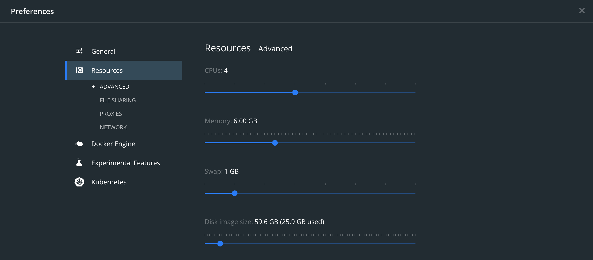
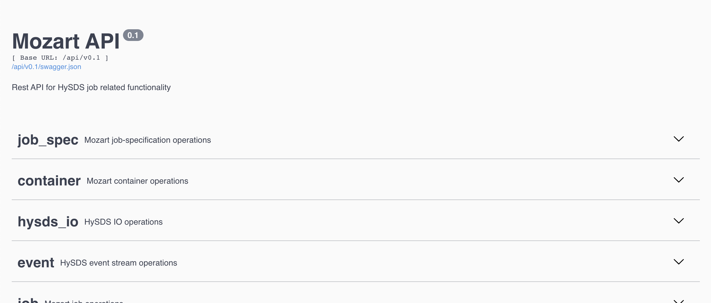

# Containerizing HySDS components/services

## Docker resource settings

Make sure to set "Memory" to value >= 6.0GB


# Building the docker image(s)

#### Building the base `hysds` docker image

```bash
docker build . -t hysds-core:unity-v0.0.1 --progress plain
```

#### Building the base docker image for the [Mozart](https://github.com/hysds/mozart) rest API

```bash
# in the hysds/mozart/rest_api/
docker build . -t hysds-mozart:unity-v0.0.1
```

#### Building the docker image for the factotum's job worker

```bash
docker build . -t factotum:unity-v0.0.1
```

```bash
$ docker images
REPOSITORY           TAG                  IMAGE ID       CREATED              SIZE
factotum             unity-v0.0.1         40015f522a83   29 hours ago         1.2GB
hysds-mozart         unity-v0.0.1         dad6831f1b04   4 seconds ago        1.1GB
hysds-core           unity-v0.0.1         82a09dc4a50a   About a minute ago   997MB
hysds-grq2           unity-v0.0.1         820b04258cad   29 hours ago         1.1GB
```

#### Create the ConfigMap for `celeryconfig.py`

```bash
# in the hysds/ root directory
kubectl create configmap celeryconfig --from-file celeryconfig.py

# if using Docker desktop
kubectl.docker create configmap celeryconfig --from-file celeryconfig.py
```

# Mozart

#### Create the ConfigMap for Mozart Rest APIs `settings.cfg`

```bash
# in the hysds/ root directory
kubectl create configmap mozart-settings --from-file ./mozart/rest_api/settings.cfg

# if using Docker desktop
kubectl.docker create configmap mozart-settings --from-file ./mozart/rest_api/settings.cfg
```

#### Create ConfigMap for Logstash

```bash
# in the hysds/mozart/ directory
kubectl create configmap logstash-configs \
  --from-file=job-status=logstash/job_status.template.json \
  --from-file=event-status=logstash/event_status.template.json \
  --from-file=worker-status=logstash/worker_status.template.json \
  --from-file=task-status=logstash/task_status.template.json \
  --from-file=logstash-conf=logstash/logstash.conf \
  --from-file=logstash-yml=logstash/logstash.yml

# if using Docker desktop
kubectl.docker create configmap logstash-configs \
  --from-file=job-status=logstash/job_status.template.json \
  --from-file=event-status=logstash/event_status.template.json \
  --from-file=worker-status=logstash/worker_status.template.json \
  --from-file=task-status=logstash/task_status.template.json \
  --from-file=logstash-conf=logstash/logstash.conf \
  --from-file=logstash-yml=logstash/logstash.yml
```

```bash
$ kubectl get cm
NAME               DATA   AGE
celeryconfig       1      8m25s
logstash-configs   6      5s
mozart-settings    1      6m46s
```

#### Starting Mozart's Elasticsearch cluster with [Helm](https://github.com/elastic/helm-charts/tree/master/elasticsearch)

```bash
helm repo update

# downloading the helm charts from the repository
helm repo add elastic https://helm.elastic.co

# in the hysds/mozart/ directory
# starting the cluster
helm install mozart-es elastic/elasticsearch --version 7.9.3 --timeout 200 -f elasticsearch/values-override.yml

# tearing down the cluster
helm uninstall mozart-es
```

```bash
$ curl http://localhost:9200
# {
#   "name" : "mozart-es-master-0",
#   "cluster_name" : "mozart-es",
#   "cluster_uuid" : "JrMWWXIWRvSsI-wjkx9MBg",
#   "version" : {
#     "number" : "7.9.3",
#     "build_flavor" : "default",
#     "build_type" : "docker",
#     "build_hash" : "c4138e51121ef06a6404866cddc601906fe5c868",
#     "build_date" : "2020-10-16T10:36:16.141335Z",
#     "build_snapshot" : false,
#     "lucene_version" : "8.6.2",
#     "minimum_wire_compatibility_version" : "6.8.0",
#     "minimum_index_compatibility_version" : "6.0.0-beta1"
#   },
#   "tagline" : "You Know, for Search"
# }
```

#### Starting the Mozart Rest API

```bash
# in the hysds/mozart/ directory
kubectl apply -f rest_api/deployment.yml
# if using Docker desktop
kubectl.docker apply -f rest_api/deployment.yml
```



#### Starting the GRQ2 Rest API

```bash
# in the hysds/grq/ directory
kubectl apply -f rest_api/deployment.yml
# if using Docker desktop
kubectl.docker apply -f rest_api/deployment.yml
```

the grq2 rest API should now be running on `http://localhost:8878/api/v0.1/`

#### Starting Redis

```bash
# in the hysds/mozart/ directory
kubectl apply -f redis/deployment.yml
# if using Docker desktop
kubectl.docker apply -f redis/deployment.yml
```

#### Starting Logstash

```bash
# in the hysds/moazrt/ directory
kubectl apply -f logstash/deployment.yml
# if using Docker desktop
kubectl.docker apply -f logstash/deployment.yml
```

#### Starting RabbitMQ

```bash
# in the hysds/moazrt/ directory
kubectl apply -f rabbitmq/deployment.yml
# if using Docker desktop
kubectl.docker apply -f rabbitmq/deployment.yml
```

# GRQ

#### Starting GRQ's Elasticsearch cluster

```bash
# downloading the helm charts from the repository
helm repo add elastic https://helm.elastic.co

# in the hysds/grq/ directory
# starting the cluster
helm install grq-es elastic/elasticsearch --version 7.9.3 -f elasticsearch/values-override.yml

# tearing down the cluster
helm uninstall grq-es
```

```bash
$ curl http://localhost:9201
# {
#   "name" : "grq-es-master-0",
#   "cluster_name" : "grq-es",
#   "cluster_uuid" : "TWnGGEdKRJaWgkt6p3gtrA",
#   "version" : {
#     "number" : "7.9.3",
#     "build_flavor" : "default",
#     "build_type" : "docker",
#     "build_hash" : "c4138e51121ef06a6404866cddc601906fe5c868",
#     "build_date" : "2020-10-16T10:36:16.141335Z",
#     "build_snapshot" : false,
#     "lucene_version" : "8.6.2",
#     "minimum_wire_compatibility_version" : "6.8.0",
#     "minimum_index_compatibility_version" : "6.0.0-beta1"
#   },
#   "tagline" : "You Know, for Search"
# }
```

#### Create the ConfigMap for GRQ's Rest APIs `settings.cfg`

```bash
# in the hysds/ root directory
kubectl create configmap grq2-settings --from-file ./grq/rest_api/settings.cfg

# if using Docker desktop
kubectl.docker create configmap grq2-settings --from-file ./grq/rest_api/settings.cfg
```

# Factotum

```bash
$ kubectl.docker create cm datasets --from-file datasets.json
# configmap/datasets created

$ kubectl.docker create cm supervisord-job-worker --from-file supervisord.conf
# configmap/supervisord-job-worker created
```

# All K8 resources

```bash
$ kubectl get all
NAME                           READY   STATUS    RESTARTS   AGE
pod/factotum-job-worker        1/1     Running   0          5s
pod/grq-es-master-0            1/1     Running   0          74s
pod/grq2-7b7b749665-8csm9      1/1     Running   0          5s
pod/logstash-f6897dbb7-qxlkd   1/1     Running   0          77s
pod/mozart-56f7f5f4b7-nngj9    1/1     Running   0          78s
pod/mozart-es-master-0         1/1     Running   0          2m24s
pod/rabbitmq-0                 1/1     Running   0          77s
pod/redis-6f486db698-h72np     1/1     Running   0          77s

NAME                         TYPE           CLUSTER-IP       EXTERNAL-IP   PORT(S)                         AGE
service/grq-es               LoadBalancer   10.107.74.255    localhost     9201:30068/TCP,9301:31307/TCP   74s
service/grq-es-headless      ClusterIP      None             <none>        9201/TCP,9301/TCP               74s
service/grq2                 LoadBalancer   10.111.253.126   localhost     8878:31290/TCP                  5s
service/kubernetes           ClusterIP      10.96.0.1        <none>        443/TCP                         73m
service/mozart               LoadBalancer   10.106.1.4       localhost     8888:30017/TCP                  78s
service/mozart-es            LoadBalancer   10.98.13.197     localhost     9200:30578/TCP,9300:31764/TCP   2m24s
service/mozart-es-headless   ClusterIP      None             <none>        9200/TCP,9300/TCP               2m24s
service/rabbitmq             NodePort       10.107.111.4     <none>        4369:30444/TCP,5672:30950/TCP   77s
service/rabbitmq-mgmt        LoadBalancer   10.106.84.161    localhost     15672:31520/TCP                 77s
service/redis                NodePort       10.111.214.190   <none>        6379:31111/TCP                  77s

NAME                       READY   UP-TO-DATE   AVAILABLE   AGE
deployment.apps/grq2       1/1     1            1           5s
deployment.apps/logstash   1/1     1            1           77s
deployment.apps/mozart     1/1     1            1           78s
deployment.apps/redis      1/1     1            1           77s

NAME                                 DESIRED   CURRENT   READY   AGE
replicaset.apps/grq2-7b7b749665      1         1         1       5s
replicaset.apps/logstash-f6897dbb7   1         1         1       77s
replicaset.apps/mozart-56f7f5f4b7    1         1         1       78s
replicaset.apps/redis-6f486db698     1         1         1       77s

NAME                                READY   AGE
statefulset.apps/grq-es-master      1/1     74s
statefulset.apps/mozart-es-master   1/1     2m24s
statefulset.apps/rabbitmq           1/1     77s
```

## Deleting K8 cluster

```bash
$ helm uninstall mozart-es
$ kubectl delete all --all
$ kubectl delete cm --all  # deletes ConfigMap(s)
$ kubectl delete pvc --all  # deletes PersistentVolume(s)

# if using Docker desktop
$ helm uninstall mozart-es
$ kubectl.docker delete all --all
$ kubectl.docker delete cm --all  # deletes ConfigMap(s)
$ kubectl.docker delete pvc --all  # deletes PersistentVolume(s)
```
